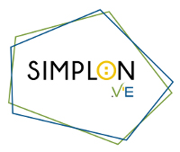
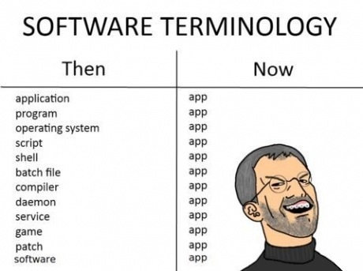
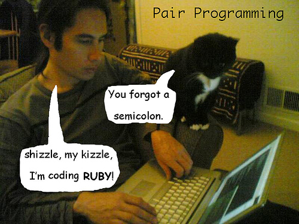

## Guide du voyageur en terre simplonienne

---
Comment travailler à Simplon

Qui est ce fameux esprit Simplon ?
_______________
* :necktie: Officiel 
* :fr: Traduction
* :computer: Chez les developpeurs
---

:necktie:

#### Une école qui propose des formations intensives de six mois
---
:fr:

Vous aller manger de l'écran 

Tous les jours !

8h par jour !
---
:computer:

Formation intense : qui pourri vos yeux, vous porterez des lunettes un jour où l'autre !
---
:necktie:

#### Simplon vous apprend à apprendre

---
:fr:

 * Simplon hacke les écoles d'ingénieurs
 * Mais le métier de développeur logiciel demande 5 ans d'apprentissage (en alternance)

---
:computer:

Skills, not diplomas

but tons of work to achieve

---
:necktie:

#### La formation sera orienté projet

---
:fr:

Vous travaillerez en équipe à réaliser un projet interne ou professionnel.

Mais dans 2 mois environ

---
:computer:

Learning by doing

---
:necktie:

#### Vous monterez en puissance grâce à vos projets

---
:fr:

Une évolution par pallier

1. projet perso
2. projet interne en groupe
3. projet professionnel en équipe

Auto-évaluation pendant entretiens individuels

---
:computer:

Ceux déjà au pallier 2 devront aider (aka recruter dans leur groupe), ceux qui n'ont pas encore passé ce pallier.

---
:necktie:

#### Simplon est une formation pour apprendre à créer des sites web et des applications web/mobile

---
:computer:

---
:fr:

3 cursus : 

*  un backend
*  un frontend
*  relation client / team leader

---
:necktie:

#### Le codage est ouvert à tous

---
:fr:

Beaucoup de gens veulent apprendre le **développement logiciel**, mais ce n'est pas pour tout le monde.

---
:computer:

Soyez employable à la fin de la formation, mais le chemin est très long avant de devenir développeur

:book: Teach Yourself Programming in Ten Years :book: 

*by Peter Norvig* 

---
:necktie:

#### Ayez l'esprit hacker : curieux et persévérant

---
:fr:

Cycle du developpeur :

* rester bloqué, 
* chercher la solution,
* trouver la solution,
* hurler de joie,
* déchanter dans 3sec qui suivent devant le problème d'après. 
---
:computer:

---
:necktie:

#### Une méthode pédagogique innovante

---
:fr:

La classe inversée
---
:computer:

La journée

---
:computer:

Le soir

---
:necktie: 

#### La formation sera basée sur l'autonomie des élèves.
---
:fr:

 * Ni diplome, ni syllabus, ni polycopiés, 
 * Pas même de classe, ni pause café de 10h à 10h10
 * Facilitateur présent pour aider
 * mais vous serez autonome dans votre apprentissage

---
:computer:

Read the Fucking Manual
---
:necktie:

#### Une journée basée sur des présentations et des binomes autonomes

***
:fr:

* Activité autonome 
* Activité quotidienne de groupe 
* Activité périodique
* Activité exceptionnelle

---
#### Activité autonome
9h à 18h (avec facilitateur disponible)

ex. Pair programming : 

L'équipe définie aléatoirement le matin, en priorisant de légères différences de niveau quand aux objectifs de la session. 

Discussion des objectifs de la pair avec le formateur avant de commencer pendant 5min

---
#### Activité quotidienne de groupe
matin : 10h-12h
aprem : 14h-16h

ex. Session de dojos

+ des la 3e semaine,
+ en petit groupe de 6 maxi,
+ apprentissage Ruby en TDD

---
#### Activité périodique

+ Hackathon interne : un/mois, sur une journée (samedi?) liste feature bien définit TDD en pair
+ Entretien individuel
+ Retrospective agile : une matinée toutes les deux semaines 

---
#### Activité exceptionnelle 
généralement en demi-journée, 
une fois toutes les semaines env (principalement)

- Intervenants extérieurs

***
:necktie:

#### Un apprentissage organique par les pairs

---
:fr:

L'équipe de formation va être sur les rotules pour répondre à toutes vos questions : ménagez-les ! 

---
:computer:

Vincent *"T'as demandé à Jean avant de me poser cette question ? Comment çà non ?"*

---
:necktie:

#### Un environnement idéal d'apprentissage

---
:fr:

Un environnement pour vous focaliser sur votre code

---
:computer:

Pas d'obstacle, de famille, d'enfants

---
:necktie:

#### Une formation où l'on apprend sans crainte

---
:fr:

Notre objectif : oubliez vos peurs

* peur d'avoir l'air stupide
* peur de votre niveau de débutant en programmation

---
:computer:

Syndrome de l'imposteur

---

### Trucs et astuces

***
#### Soyez rigoureux 

---
Essayez de comprendre comment votre code fonctionne

---
Comprennez comment votre outils de travail fonctionnent

---
Allez en profondeur, ne pas se contenter de grater la surface jusqu'a ce que ca marche

***
***
#### Visez le ciel

---
 
L'équipe vous a choisie parcequ'on croit en vous

---
Et nous aussi, on essaie de s'améliorer !

---
On sait tous que nous n'y sommes pas encore

***

***
#### Prenez du recul et réfléchissez à votre formation

---
Augmenter vos capacités de programamtion mais aussi votre capacité à apprendre

---
Ecrivez votre blog pour cristalliser vos concepts

---
Demander des code review, du feedback des astuces autour de vous.

***

Des questions ?